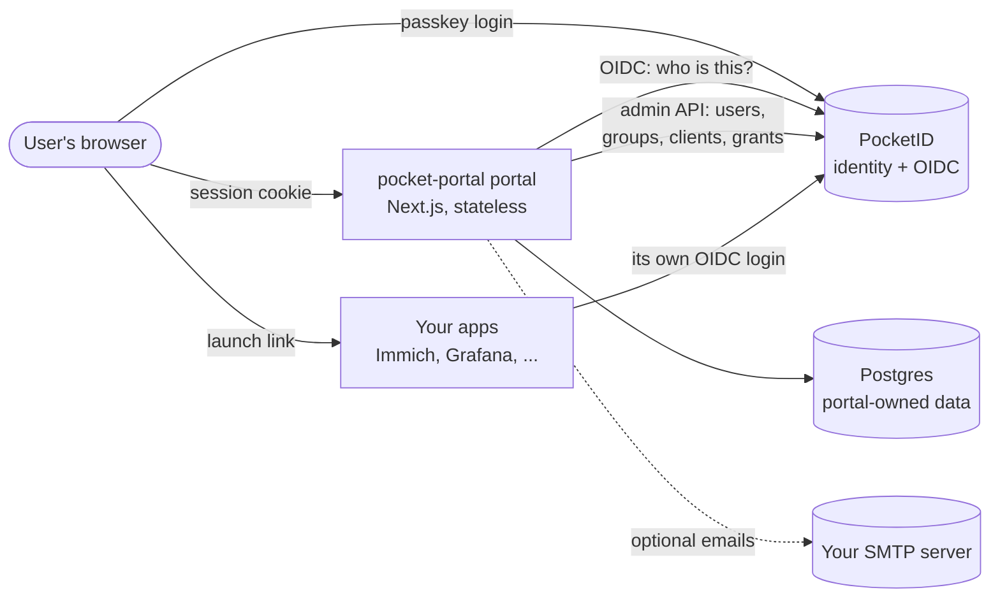
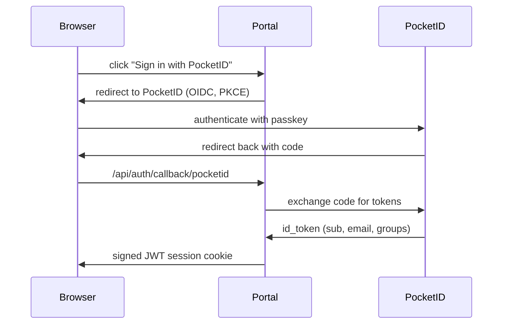
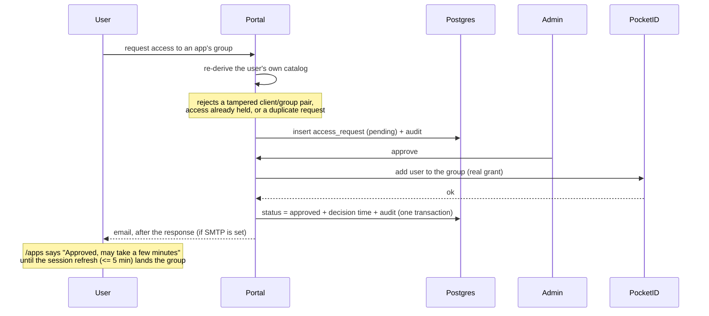
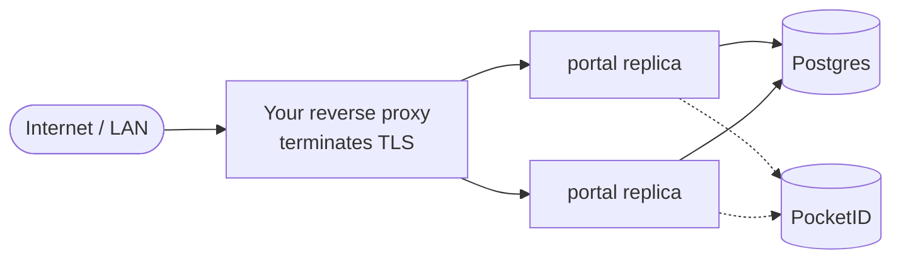

# Architecture

How the pieces fit together. The [ADRs](adr/) record *why* each decision was
made, one at a time; this page shows *what the system is* today.

## The one-paragraph version

pocket-portal is a **launcher**, not a gateway. It shows a user which apps
they can reach and lets them request access to the rest. PocketID owns all
identity — users, groups, and which app each group unlocks — and enforces
access at each app's own login. The portal never sits in the traffic path
to those apps, so if it goes down, nothing loses access
([ADR-0001](adr/0001-launcher-not-gateway.md)).

## Components



The arrow that is *not* there matters most: no traffic to your apps passes
through the portal.

## Who owns what

The portal stores as little as possible. Anything PocketID already knows is
read live rather than copied ([ADR-0007](adr/0007-pocketid-live-catalog.md)),
so there is no sync job and no stale mirror to reconcile.

| Data | Owner | Notes |
|---|---|---|
| Users, passkeys, groups | **PocketID** | The portal never stores a user record |
| The app catalog | **PocketID** | Each app is an OIDC client; its group restriction *is* the access rule |
| Which apps are hidden | Postgres `app_overrides` | The portal's only opinion about an app — usually empty |
| Access requests | Postgres `access_requests` | Requester, target group, message, status, decision time |
| Audit trail | Postgres `audit_log` | Separate from logs on purpose ([ADR-0006](adr/0006-audit-trail-separate-from-logs.md)) |
| Session claims | Postgres `session_claims` | Last groups/admin PocketID verified per user, and the refresh throttle |
| Sessions | **Nobody** | Signed JWT cookie; no server-side store ([ADR-0004](adr/0004-portal-oidc-login.md)) |

That last row is what makes the portal stateless: any replica can serve any
request, and restarting one loses nothing.

## Signing in



The session cookie carries the user's groups and admin flag. Those are
**re-derived from PocketID every 5 minutes** rather than frozen at login, so
a grant or revoke takes effect within one refresh instead of requiring the
user to sign out (`GROUPS_REFRESH_INTERVAL_MS` in
`src/lib/auth/claims-refresh.ts`).

The throttle and the last verified claims live in Postgres
(`session_claims`), not in the cookie. A cookie is client-held, so a client
replaying an old one could otherwise force a PocketID call on every request,
or resurrect claims PocketID has since revoked. Only a stale-looking cookie
reads the row; one request per user per interval wins the refresh, and the
others take the claims it verified.

If PocketID is unreachable the refresh fails open — it keeps the existing
claims rather than dropping the user mid-session — and retries next cycle.
That is bounded for admin rights: after 15 minutes without a successful
verification (`ADMIN_MAX_UNVERIFIED_MS`), the session loses admin until a
refresh succeeds, while keeping its groups. The same holds if Postgres is
down, and PocketID is then not called at all.

## Requesting and granting access



Admins are emailed about each new request the same way. Emails go out after
the response, best-effort, and never fail the action
([ADR-0009](adr/0009-email-notifications-inline-after-response.md)). With
`FEATURE_ACCESS_REQUESTS=false` none of this appears: `/apps` lists only
what the user can open.

Three deliberate properties:

- **The grant is real.** Approving calls PocketID's group-membership API; it
  is not a portal-local flag ([ADR-0002](adr/0002-self-service-access-requests.md)).
- **A failed grant leaves the request pending.** The status change and its
  audit row share a transaction, so the portal never claims to have granted
  something it did not. A request whose app was hidden, or whose group was
  removed, offers Deny only.
- **The requester is told where they stand.** `/apps` derives a state per
  app and group from their own requests plus the groups their session
  carries, rather than showing a bare request form for everything they
  cannot currently reach:

  | State | Meaning | Can request |
  |---|---|---|
  | `pending` | awaiting a decision | no |
  | `settling` | approved; the session's groups have not caught up yet | no |
  | `revoked` | approved long enough ago that it should have landed, and the group is gone | yes |
  | `denied` | an admin said no | yes |

  `settling` exists because session groups lag PocketID by up to one refresh
  interval, so for a few minutes after approval the portal knows the grant
  happened while `hasAccess` still reads false. Offering a request form there
  would offer an action that cannot succeed.

  Telling `settling` from `revoked` is what `decided_at` is for. Re-requesting
  a revoked grant reopens the existing row rather than inserting a second one —
  the partial unique index covers every non-denied row — and the portal
  confirms with PocketID before doing so, since a failed session refresh keeps
  stale groups and could otherwise make a live grant look revoked.

### What lands in the audit trail

Every transition a reviewer would ask about is written to `audit_log`
([ADR-0006](adr/0006-audit-trail-separate-from-logs.md)), in the same
transaction as the change it records wherever that coupling matters:

| Action | Written when |
|---|---|
| `access_request.created` | a user files a request |
| `access_request.approved` | an admin approves, *after* the PocketID grant succeeds |
| `access_request.denied` | an admin denies |
| `access_request.reopened` | a user re-requests a grant that was revoked |
| `access_request.grant_failed` | the PocketID grant attempt failed for any reason — refusal, timeout, unreachable; the request stays pending |
| `access_request.grant_rejected` | the target group is no longer a grantable group of its client |

The two `grant_*` actions exist so a request that never became access still
leaves a trace of why. Admins browse the trail at `/admin/audit`, newest
first and filterable by action (`FEATURE_AUDIT_LOG_PAGE=false` hides the
page, not the recording).

## Request path inside the portal

Every page render calls `auth()` in the root layout, which is why the portal
returns 500 rather than a degraded page when PocketID is unconfigured. The
layout also reads PocketID's public branding (accent colour, name, logo). That
read is cached per replica for 5 minutes, times out after 2s, and falls
back to the portal's own look rather than failing.

```
browser
  └─ root layout ── auth() ── session cookie ─┬─ valid ──> page
                                              └─ stale? ──> session_claims row ─> refresh from PocketID (one request per user per interval)
       └─ SiteHeader (nav, skip link)
       └─ page (server component)
            └─ requireUser() / requireAdmin()
            └─ reads: PocketID (live) + Postgres
            └─ writes: server actions only
```

API routes (`/api/health`, `/api/ready`, `/api/metrics`, `/api/auth/*`) sit
outside the layout, so they answer with no PocketID configuration at all —
which is what makes `/api/health` usable as a liveness probe.

## Running it



The portal is stateless, so replicas need no sticky sessions, but they must
share `AUTH_SECRET`, or a cookie issued by one is rejected by another. The
reverse proxy is yours; the portal only asks that it terminate TLS and
either pass a correct `Host` or let `AUTH_URL` pin the origin. On
Kubernetes, the [Helm chart](https://github.com/FB-UNIV/pocket-portal-helm) runs this shape directly. See the
[runbook](RUNBOOK.md) for the full contract.

## Where the code lives

| Path | Responsibility |
|---|---|
| `src/app/` | Routes. Pages are server components; mutations are server actions |
| `src/app/_components/` | Shared UI: the site header, the PocketID-secrets banner |
| `src/lib/config.ts` | Every setting, read through one typed module, plus the registry of variables and startup validation |
| `src/lib/config-file.ts` | The optional YAML config file, applied once at boot |
| `src/lib/pocketid/` | Every call to PocketID, including its public branding. Nothing else talks to it directly |
| `src/lib/catalog/` | Joins PocketID's OIDC clients with `app_overrides` into the catalog |
| `src/lib/requests/` | Access-request lifecycle |
| `src/lib/auth/` | Session callbacks and claims refresh, `requireUser`/`requireAdmin`, origin pinning |
| `src/lib/audit/` | Audit writes, and the paged read behind `/admin/audit` |
| `src/lib/notifications/` | Access-request emails (SMTP) |
| `src/lib/format/` | Shared formatting (UTC timestamps) |
| `src/lib/db/` | Drizzle schema and connection |
| `src/lib/health/` | Dependency probes behind `/api/ready` |
| `src/lib/observability/` | Pino logger, OTel, Prometheus registry |
| `scripts/migrate.mjs` | Migration runner; ships inside the image |
| `docker-entrypoint.sh` | Resolves `NAME_FILE` secrets, runs migrations, starts the server |

## Constraints worth knowing before you change things

- **Stateless.** No in-process session or cache state that another replica
  cannot see. Caching is allowed only where losing or diverging it is
  harmless.
- **Configuration goes through `src/lib/config.ts`.** Never read
  `process.env` directly: a new setting belongs in the registry, which is
  what validation, the config file and the docs' drift tests build on.
- **PocketID is the source of truth.** Don't copy its data into Postgres.
  Verify endpoint shapes against [its API docs](https://pocket-id.org/docs/api)
  or a live instance rather than from memory.
- **Server actions are RPC endpoints.** Re-derive and re-check on the
  server; never trust that the submitted form is the one you rendered.
